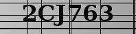

#  CRNN OCR 
[](https://colab.research.google.com/drive/1Fa_WgMyz9ZrWhPtcJ1DGR5GiQuix_1wM?usp=sharing)
[](https://www.kaggle.com/datasets/sandeep1507/captchaimgdata)

This repository provides you with a deployable model to solve captchas which contains characters with random alphanumeric character which has been strikethrough vertically and/or horizontally. 

The tool to scrap these images from the website is also available on [google colab](https://colab.research.google.com/drive/1cjwTIkQuU0ZUtSY8QKtg69gHR5PLnKLm?usp=sharing)

Check out my [LinkedIn post](https://www.linkedin.com/posts/sandppatel_i-have-created-a-crnn-model-to-solve-the-activity-7087672345380683777-3DOk?utm_source=share&utm_medium=member_desktop) for the description, use case, and other relevant information.

## Table of Contents

- [Type of solvable captchas:](#type-of-solvable-captchas:)
- [How to use](#how-to-use)
    - [By Google Notebook](#by-google-notebook)
    - [By using this repo](#by-using-this-repo) 
        - [Use the model provide directly](#use-the-model-provide-directly)
        - [Train the model and then use it](#train-the-model-and-then-use-it)
- [Accuracy](#accuracy)
    - [repos test dataset](#repos-test-dataset)
    - [Notebooks](#notebooks) 
- [CONTRIBUTING](#CONTRIBUTING)

## Type of solvable captchas:



## How to use
### By Google Notebook
Make sure you have a Google account and are signed in to access and run the notebook.
1. Go to [Colab Notebook](https://colab.research.google.com/drive/1mafV7t0o0mPMyH1rObs60o3DNy8KDsUs?usp=sharing)

2. Add your folder path to [captchasolve](https://colab.research.google.com/drive/1mafV7t0o0mPMyH1rObs60o3DNy8KDsUs#scrollTo=gA_ikL1Z5tQv&line=4&uniqifier=1) function and get a list of strings with predicted texts.

3. Follow the instructions provided in the notebook to run and interact with the project.

### By using this repo
1. Download the zip file of the repo and extract it
#### Use the model provide directly
1. Add your captcha in [Userset](./Data/userset/) directory present in [Data](./Data/) Directory
2. Run the [Using_Model.py](./Python%20Version/Using_Model.py) present in the [Python Version](./Python%20Version/) directory in your python compiler
3. Wait until the file has finished running, then the alphanumaric string after "For user provided captcha: " will be your output
<details>
<summary>Example</summary>
In output:

```python:
For user provided captcha: 
1/1 [==============================] - 0s 30ms/step
['2DG53S']
```
Your ans is 2DG53S

Here the captcha was: 


</details>

#### Train the model and then use it
(If you want to see/change the training data, u can do so by change the contents of [trainset](./Data/trainset/) directory present in [Data](./Data/) Directory)
1. Run the [training_model.py](./Python%20Version/training_model.py) present in the [Python Version](./Python%20Version/) directory in your python compiler
2. Then do the steps provieded for [Use the model provide directly](#use-the-model-provide-directly)

## Accuracy
You can test the accuracy by either using the [repos test dataset](#repos-test-dataset) or by [Notebooks](#notebooks) 
### Using repos test dataset

Use the steps provieded for [Use the model provide directly](#use-the-model-provide-directly) but this time see the output after "For testdataset"

You can see/change the test data in the [testset](./Data/testset/) directory present in [Data](./Data/) Directory 

### Using notebooks
[](https://www.kaggle.com/code/sandeep1507/testing-model-accuracy)
[](https://colab.research.google.com/drive/1mafV7t0o0mPMyH1rObs60o3DNy8KDsUs?usp=sharing)

1. Test the accuracy of model using the notebooks given above on testdataset.

add it in the first line

## CONTRIBUTING
Contributions are always welcome! Whether it's a feature request, bug fix, or a new idea, feel free to submit a pull request or open an issue. Let's enhance this tool together!
Be sure to read [CONTRIBUTING](CONTRIBUTING.md) file to know about more contributions details.
