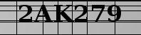

# CRNN OCR 
[](https://colab.research.google.com/drive/1Fa_WgMyz9ZrWhPtcJ1DGR5GiQuix_1wM?usp=sharing)
[](https://www.kaggle.com/datasets/sandeep1507/captchaimgdata)
[](https://opensource.org/licenses/MIT)

This repo provides you with the model to solve captchas of this specific type.



And the tool to scrap these images from the website is on [](https://colab.research.google.com/drive/1cjwTIkQuU0ZUtSY8QKtg69gHR5PLnKLm?usp=sharing)


## Table of Contents

- [Usage](#usage)
- [Contributing](#contributing)
- [License](#license)

## Usage
To use this project, follow these steps:

1. Open the [Colab Notebook](https://colab.research.google.com/drive/1Fa_WgMyz9ZrWhPtcJ1DGR5GiQuix_1wM?usp=sharing) in Google Colab.

2. Click on the "Open in Colab" button at the top of the notebook to launch it in Google Colab.

3. Follow the instructions provided in the notebook to run and interact with the project.

Make sure you have a Google account and are signed in to access and run the notebook.

[](COLAB_NOTEBOOK_LINK)


```bash
$ pip install pillow
$ pip install tensorflow
$ pip install numpy

